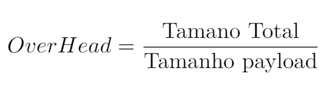

# Projeto 3 : HandShake

  Para estabelecer comunicação entre um servidor e qualquer cliente que queria se comunicar com o mesmo, é necessário um acordo prévio
  feito pelo protocolo para otimizar a coneneção entre ambos server e client. Além disso, o termo HandShake remete justamente a um aberto de mãos, ou seja, algo realizado para concentrizar que a comunicação foi estabecida. 
  
  O funcionamento do empacotamento é demonstrado a seguir:
  

## Código Final

O código possui os seguintes arquivos : server.py; server.py; enlace.py; enlaceTx.py; enlaceRx.py; interfaceFisica.py. Sendo cada um responsável por :

server.py : Código que prepara o computador para receber a imagem do Client. Neste momento o server também tem funções de enviar pacotes, após 

client.py : Código que transmite a imagem e aguarda o fim da transmissão.

enlace.py : Interface de comunicação entre a aplicação e o enlace 

enlaceTx.py : Parte do enlace responsável por encapsular os dados em um pacote.

enlaceRx.py : Parte do enlace responsável por receber e desencapsular os dados.

interfaceFisica.py : Código que lida com o envio dos dados para o Arduino e recebimento.

### Informações do Header e End Of Package

  O header (Head) e End Of Package (EOP) são as partes do pacote que servirão de referência para o server, se localizando dentro do pacote, assim ele saberá qual tamanho do próprio Head e EOP, tamanho do payload, e com isso o recebimento será mais preciso quanto à perda de dados e corrompimento de dados.

## Cálculo do OverHead, BaudRate e ThroughPut

  Overhead é a relação do tamanho do tamanho total do pacote com o tamanho do payload, para isso utiliza-se a razão entre o tamanho total e o tamanho do payload, encontrando assim quantos payloads cabem no pacote total, ou quantas vezes o pacote é maior que o payload.
  
  
  BaudRate é a quantidade de bits que uma rede consegue transmitir por segundo.

  ThroughPut é a quantidade de dados que uma rede consegue transmitir por segundo.
